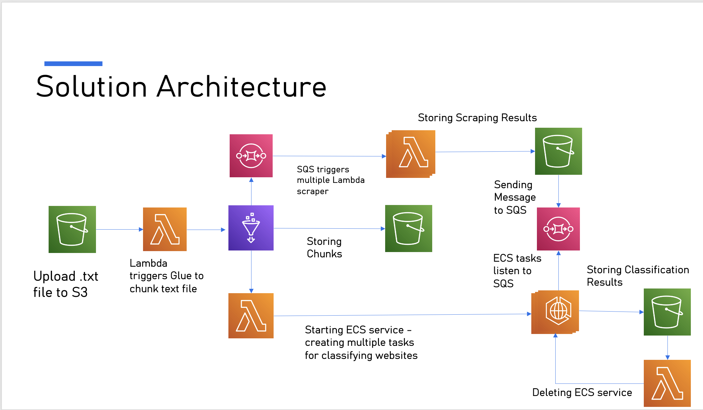

# Lambda Everywhere 🚀

Automating scalable website scraping and classification using AWS Lambda, ECS, Glue, S3 and SQS

---

## 📌 Overview

Lambda Everywhere demonstrates how AWS Lambda can orchestrate, **execute**, and automate a wide variety of tasks in a serverless architecture, including:

✅ Triggering data pipelines (Glue) on file uploads  
✅ Performing and orchestrating website scraping workflows  
✅ Managing ECS workloads for large-scale classification  
✅ Automating cleanup and lifecycle management

All while ensuring **cost-effective, scalable, event-driven processing of real-world workflows**.

## 🩶 Problem

Organizations need to **monitor and analyze millions of websites** for competitive intelligence, pricing insights, brand monitoring, and compliance. However, building and maintaining large-scale scraping and classification pipelines traditionally requires **complex, costly infrastructure and significant engineering effort**, limiting scalability and agility.


## 🚀 Solution

Using AWS Lambda, I created a fully automated serverless pipeline:

1️⃣ Upload a `.txt` file of websites to an S3 bucket.  
2️⃣ Lambda triggers a Glue job to chunk the list into manageable parts.  
3️⃣ Glue sends SQS messages for each chunk.  
4️⃣ Once chunking is complete and the number of chunks is known, **Glue triggers a Lambda function that creates an ECS service with the number of tasks equal to the number of chunks**. Glue performs three key jobs: **chunking the uploaded file, sending SQS messages for each chunk, and triggering the Lambda function to create the ECS service**. Since ECS task creation takes time, scraping and ECS task creation proceed in parallel.


The ECS service runs a **worker container** that continuously listens to the SQS queue:

```python
"""
Website Classification Worker (AWS ECS + SQS + S3)

- Runs inside a Fargate container.
- Continuously polls an SQS queue for messages containing S3 paths to scraped CSV chunks.
- Downloads each chunk from S3.
- Performs zero-shot classification on each row using Hugging Face BART MNLI.
- Uploads labeled results to S3 for downstream use.

Input SQS message:
    { "s3_path": "lemay/outputs_sqs/filename.csv" }

Output stored to:
    s3://lemay/labeled_websites/
"""
```

5️⃣ Lambda functions scrape websites (using `requests` + `BeautifulSoup`), respecting `robots.txt`, and summarize page content into structured text suitable for classification. Since this project runs in a sandbox environment, I could not allocate sufficient resources to Lambda to use Selenium for JavaScript-heavy websites, so the scraper focuses on efficiently extracting content from the first page of static and lightweight websites.

6️⃣ Scraped data is stored in S3, and Glue sends SQS messages with metadata for each scraped chunk. The ECS worker, continuously listening to the SQS queue, picks up these messages for classification.

7️⃣ ECS tasks perform zero-shot classification using Hugging Face BART MNLI inside the container, labeling each website's content (e.g., `news`, `education`, `shopping`).

8️⃣ A Lambda function monitors the pipeline, and once the number of classified files in the S3 output bucket matches the number of chunks, the Lambda automatically deletes the ECS service, completing the pipeline.
ction monitors the pipeline, and **once the number of classified files in the S3 output bucket matches the number of chunks**, the Lambda **automatically deletes the ECS service**, completing the pipeline.

All orchestrated **serverlessly using AWS Lambda as the backbone**, enabling scalable, cost-efficient processing of large-scale website scraping and classification workflows.

## 🛠️ Architecture



Lambda Everywhere follows an **event-driven, serverless architecture**:

- **S3** stores input files, scraped outputs, and classified results.
- **Glue** chunks large files and sends metadata to **SQS**.
- **Lambda functions**:
   - Trigger Glue jobs on uploads.
   - Perform scraping using BeautifulSoup and requests.
   - Monitor ECS lifecycle.
- **SQS queues** decouple Glue, Lambda, and ECS.
- **ECS Fargate** runs containerized workers for classification using Hugging Face.
- **Lambda** automatically shuts down ECS upon pipeline completion.

This architecture enables **scalable, automated website scraping and classification without manual intervention or persistent servers.**

## 🌟 Key Features

✅ **Serverless pipeline:** Fully automated using AWS Lambda, ECS, Glue, S3, and SQS.  
✅ **Efficient scraping:** Lightweight, respectful scraping of websites with structured summaries.  
✅ **Zero-shot classification:** Uses Hugging Face BART MNLI to label content without task-specific fine-tuning.  
✅ **Event-driven architecture:** Scales automatically without manual intervention.  
✅ **Lifecycle management:** ECS services start and stop automatically based on pipeline progress.  
✅ **Cost-effective and scalable:** Designed for analyzing millions of websites efficiently.

## 🧩 Technologies Used

- **AWS Lambda** – event-driven orchestration and scraping.
- **AWS Glue** – chunking large input files.
- **AWS SQS** – decoupling tasks for scalable processing.
- **AWS ECS Fargate** – serverless container execution for classification.
- **AWS S3** – storage of input, intermediate, and output data.
- **BeautifulSoup, Requests** – lightweight web scraping.
- **Hugging Face Transformers** – zero-shot text classification.
- **Python 3.12, Boto3** – pipeline processing and data handling.

## 🎥 Demo Video

[Watch the 3-minute demo here ➡️](link_to_your_demo_video)

## 🚀 Future Improvements

- Integrate **AWS CDK** for full infrastructure reproducibility.
- Use **Selenium with Lambda containers** for scraping JavaScript-heavy websites.
- Add **monitoring and notifications** via SNS/Slack.
- Explore **AWS Bedrock** for classification at scale.
- Build dashboards for insights on classified websites.
